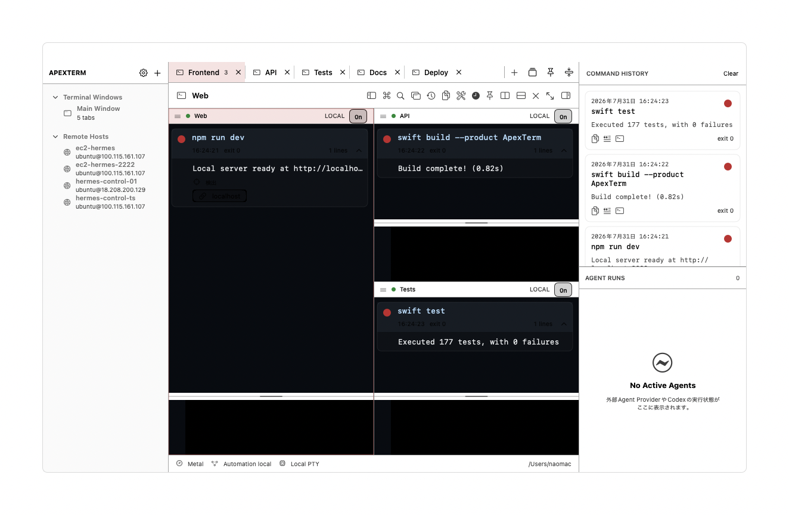
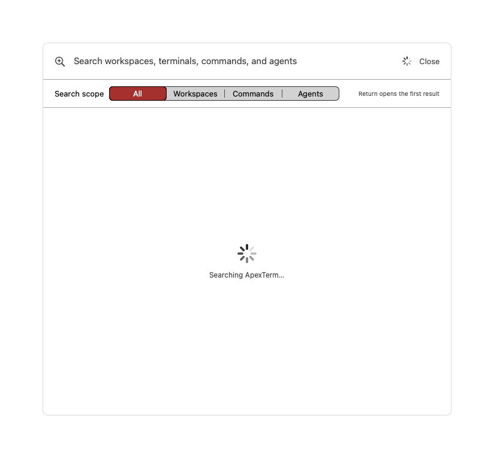
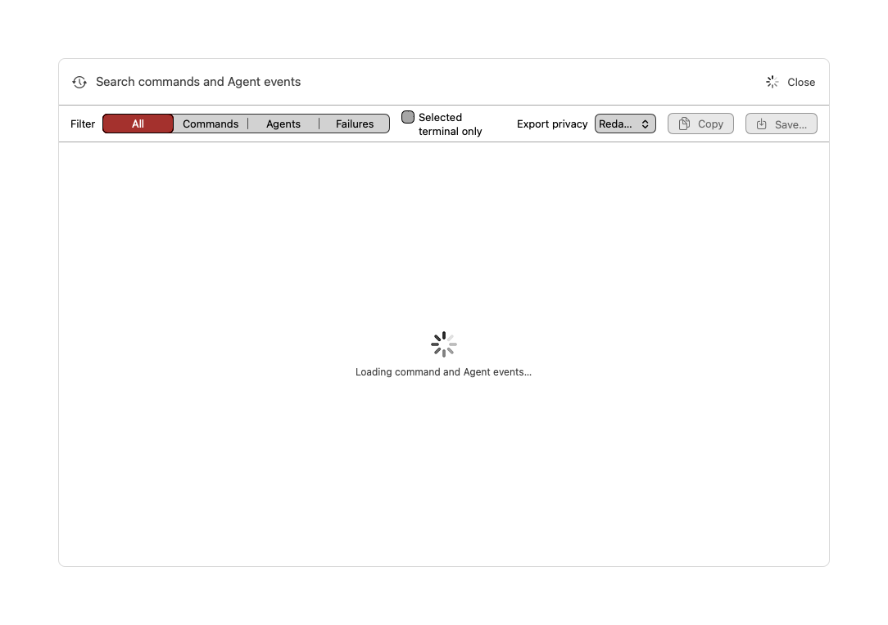
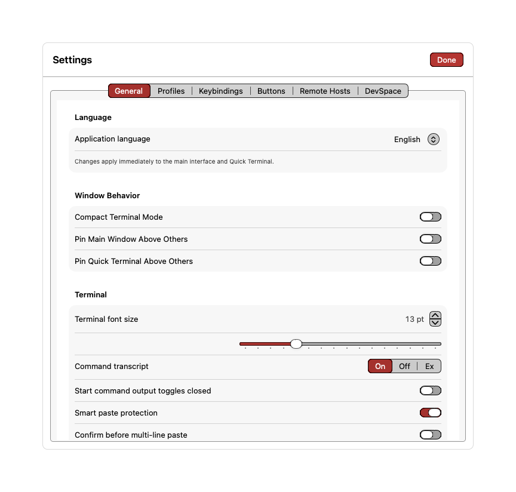
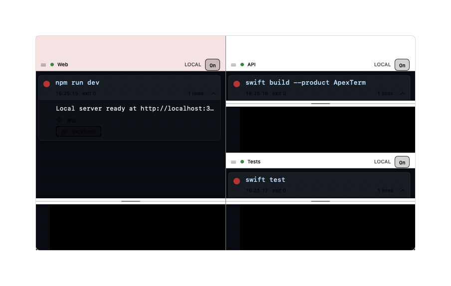

# ApexTerm

[English](../README.md) · **日本語** · [简体中文](README.zh-Hans.md) · [繁體中文](README.zh-Hant.md) · [한국어](README.ko.md)

ApexTermは、タブ・分割ペイン・コマンド履歴・tmux・ショートカット操作を一つのネイティブmacOSアプリにまとめたターミナルワークスペースです。

> ApexTermは開発中です。開発版を試す前に、重要なターミナル作業は保存してください。

## 画面と主な機能



- タブと入れ子の分割ペイン
- タブ・ペインを素早く移動できる変更可能なショートカット
- On / Off / Exのコマンドトランスクリプト
- 最新出力コピーと完了通知
- 小さいウィンドウ向けのコンパクトタブ表示
- tmuxセッションとリモートホストプロファイル

### 横断検索



`⌘K`でWorkspace、Terminal Session、Command、Agent Chat、Agent Eventを横断検索できます。

### Command Timeline



成功・失敗、コマンド、Agentイベントを同じ時系列で検索・絞り込みできます。Markdown出力はメタデータのみ、秘匿化、全文から選択できます。

### 設定と言語



アプリの表示言語、ターミナル表示、履歴、サイドバー、ショートカット、DevSpace案内をSettingsから変更できます。

### コンパクト表示



小幅時はタブ名が丸いアイコンへ自動で切り替わり、区切り線を保ったまま識別できます。

## 必要環境

- macOS 14以降
- Swift 6.2対応のXcode Command Line Tools

## ビルド

```zsh
swift build --product ApexTerm
zsh scripts/build-app.zsh
```

署名済みローカルアプリは既定で`.artifacts/ApexTerm.app`へ生成されます。

## README画像の再生成

```zsh
zsh scripts/capture-readme-screenshots.zsh
```

スクリプトは独立したApexTermデモアプリを起動し、白背景の画像を`docs/images/`へ生成します。通常使用中のApexTermやそのセッションは終了しません。

## 任意のDevSpace連携

ApexTermは単体で利用できます。ChatGPTから許可したローカルプロジェクトを確認・編集したい場合は、任意で公開フォークをセットアップできます。

- [uniplanck/devspace](https://github.com/uniplanck/devspace)

DevSpaceは別途セルフホストするMCPサーバーです。ApexTermのターミナル、タブ、ペイン、履歴、tmux機能には必要ありません。

## セキュリティ

APIキー、Cookie、秘密鍵、`.env`、ローカル認証ファイルをcommitしないでください。DevSpaceには意図して公開するフォルダだけを許可してください。
